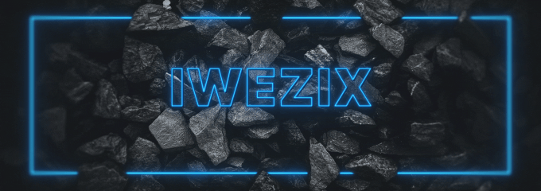

<!-- Banner -->

    

<h3 align="center">
    
</h3>

<h1 align="center">Welcome to my GitHub profile !</h1>
<h3 align="center">I am Luca, a Fullstack developer</h3>

<!-- Profile views -->

 
     
    

- 🔭 I’m currently working on my own project

- 🌱 I’m currently learning **React Native & .NET**

- 👨‍💻 All of my publics projects are available [here]([https://github.com/IweZix](https://github.com/IweZix?tab=repositories&q=&type=public&language=&sort=)

- 💬 Ask me about **nest.js**

- 📫 How to reach me [discord](https://discord.gg/68sTKh3UYV) or **contact@iwezix.xyz**

<!-- Social media -->
<!-- <h3 textalign="left">Connect with me:</h3>

    
    
    
    
    

 -->

 

<!-- Languages and Tools -->
<h1 align="center">🔥 Languages - Framework - Tools 🔥</h1>
<!-- Languages -->

  

<!-- Tools -->

  

 

<!-- GitHub Stats -->
<h1 align="center">⚡️ Stats ⚡️</h1>

    

        
    

    

        
    

    

        
    

 
